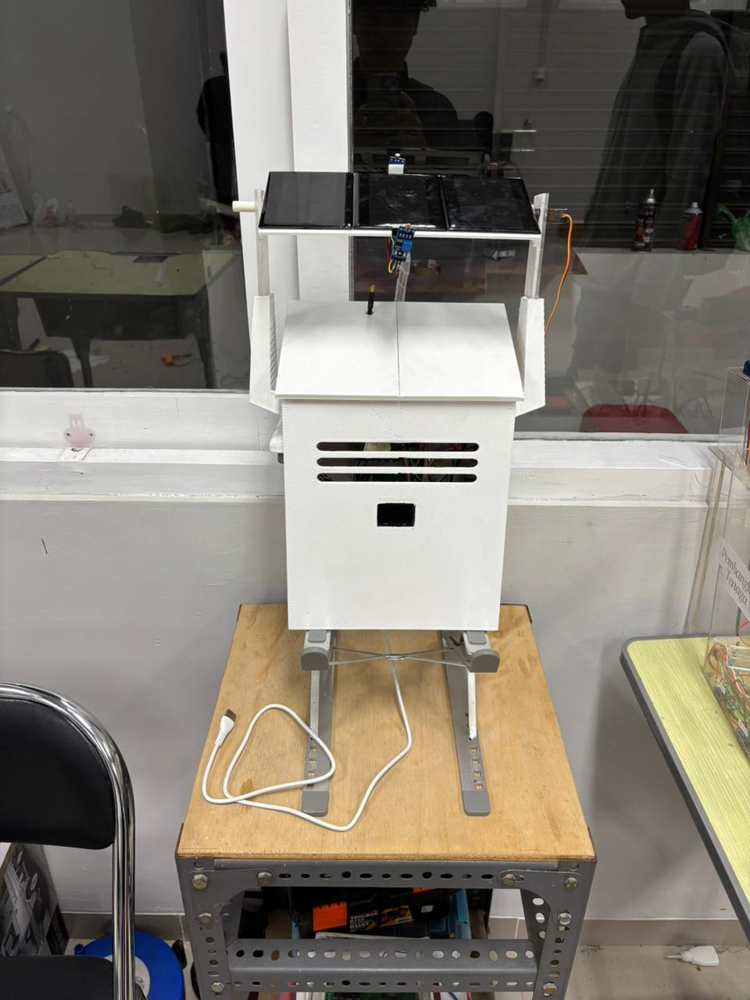
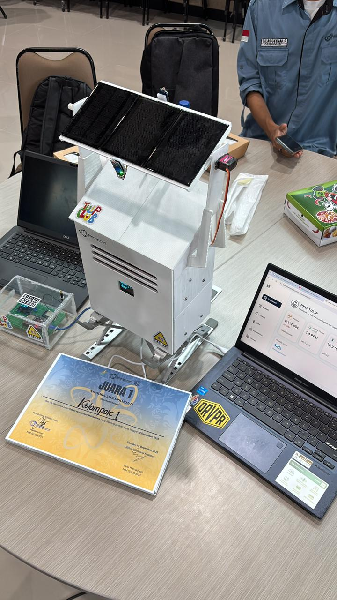
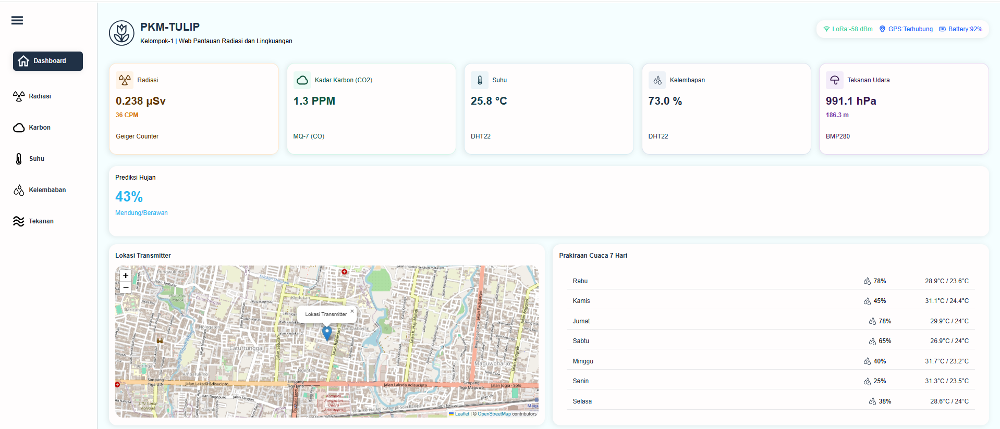

<div align="center">

  

  # PKM-TULIP: Smart Radiation & Air Quality Monitoring
  
  **Sistem Pemantauan Interaktif Kualitas Udara dan Radiasi Berbasis IoT untuk Edukasi Nuklir**

  
  
  
  
  

</div>

---

## 📖 Latar Belakang & Motivasi

Kualitas udara dan tingkat radiasi lingkungan merupakan dua indikator vital yang berdampak langsung pada kesehatan manusia. Namun, literasi masyarakat terhadap bahaya radiasi dan polusi udara seringkali masih rendah.

**PKM-TULIP** hadir sebagai solusi inovatif yang menggabungkan teknologi nuklir dan *Internet of Things* (IoT). Proyek ini bertujuan untuk:
1.  **Demokratisasi Data:** Menyediakan data lingkungan yang transparan dan *real-time* bagi masyarakat.
2.  **Edukasi Nuklir:** Memberikan pemahaman bahwa radiasi lingkungan dapat diukur dan dipantau secara aman.
3.  **Sistem Peringatan Dini:** Mendeteksi lonjakan gas berbahaya (CO) dan anomali radiasi gamma di lingkungan sekitar.

---

## 📸 Dokumentasi Perangkat (Hardware Gallery)

Berikut adalah implementasi fisik dari *Node Sensor* yang telah dikembangkan. Alat ini dirancang *compact*, *portable*, dan tahan terhadap kondisi luar ruangan.

<div align="center">
  <table border="0">
    <tr>
      <td align="center">
        <br>
        <b>Tampak Depan (Casing 3D Print)</b>
      </td>
      <td align="center">
        <br>
        <b>Komponen Internal & Sensor</b>
      </td>
    </tr>
  </table>
  <br>
  <i>Desain menggunakan casing PLA+ dengan ventilasi udara untuk sensor gas dan perlindungan tabung Geiger Müller.</i>
</div>

---

## 💻 Visualisasi Dashboard Web

Data yang dikirim oleh alat dapat diakses melalui dashboard berbasis web yang responsif. Tampilan ini dirancang agar mudah dipahami oleh pengguna awam sekalipun.

<div align="center">
  
  <br>
  <i>Fitur Dashboard: Grafik Real-time, Indikator Status (Aman/Bahaya), Peta Lokasi GPS, dan Angka Parameter Terkini.</i>
</div>

---

## 🏗️ Arsitektur & Alur Sistem

Sistem bekerja dengan prinsip *Telemetri Jarak Jauh*. Sensor mengambil data di lapangan, dikirim via LoRa ke Gateway, lalu diunggah ke Cloud.

```mermaid
graph LR
    subgraph NODE SENSOR [Transmitter - Lapangan]
    A1[Sensor MQ-7/MQ-135] -->|ADC| MCU1(ESP32 Node)
    A2[Geiger Counter] -->|Interrupt| MCU1
    A3[GPS NEO-7M] -->|UART| MCU1
    MCU1 -->|LoRa 433MHz| RF{Udara Bebas}
    end
    
    subgraph GATEWAY [Receiver - Indoor]
    RF -->|Receiver| MCU2(ESP32 Gateway)
    MCU2 -->|WiFi HTTP| CLOUD[ThingSpeak Server]
    end
    
    subgraph USER INTERFACE
    CLOUD -->|JSON API| WEB[Web Dashboard]
    WEB -->|Visualisasi| USER[Masyarakat]
    end
